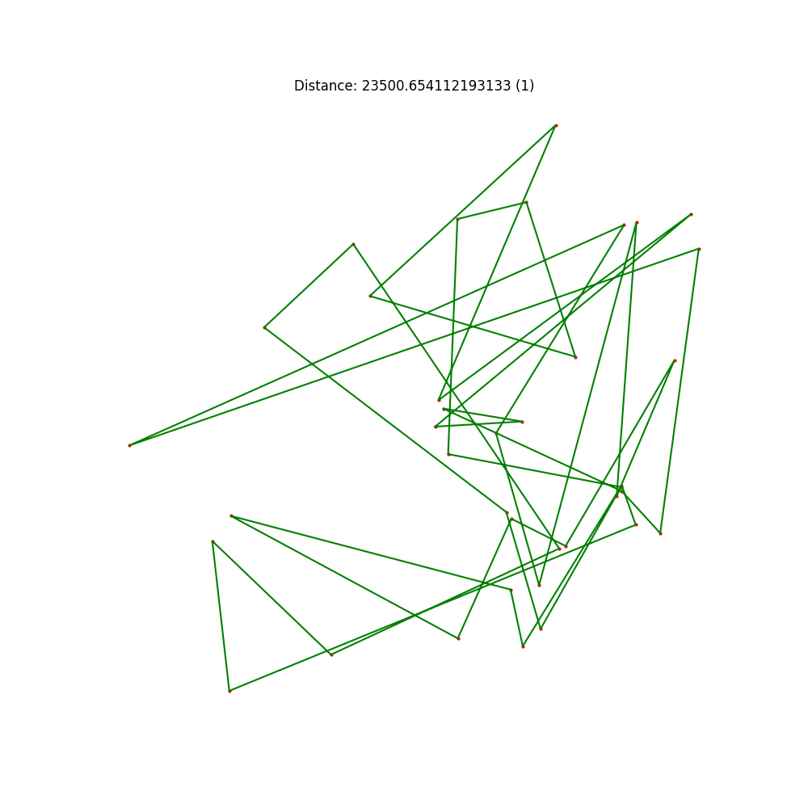
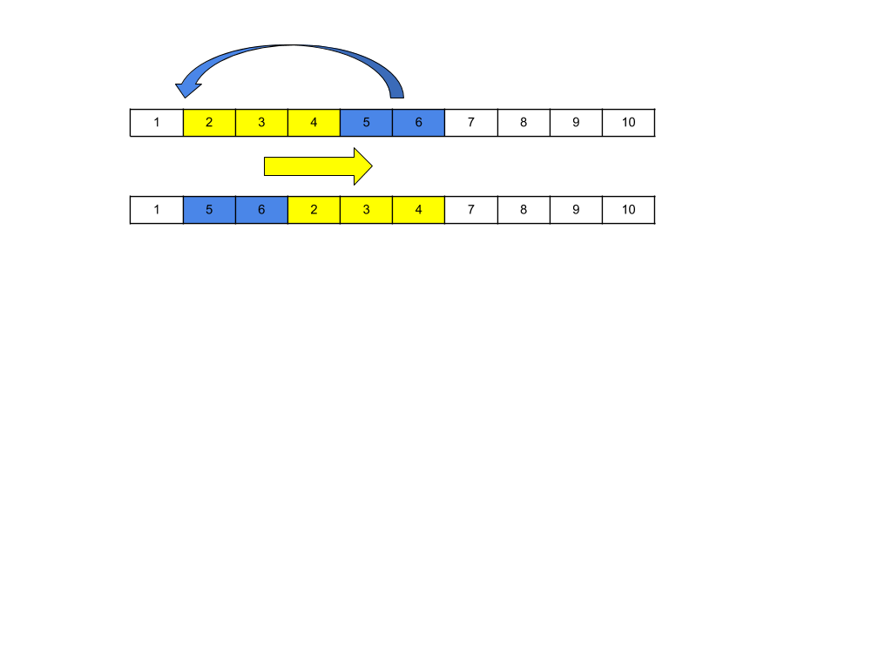

# tsp-py
Yet another repository for traveling salesman problem (TSP) in python

There are 2 ways to look at this problem:

- Decision (NP-Complete) Can you visit all cities in less than X distance?
- Optimization (NP-Hard). Visit all cities once and find shortest route.

Very good explanation of a problem is in Wikipedia https://en.wikipedia.org/wiki/Travelling_salesman_problem

There is no known algorithm which solves this problem in polynomial time.

## Algorithms

This repository contains implementation of few most popular **optimization** algorithms

### Bruteforce
Algorithm is straightforward and tries all routes, which is bad idea for datasets having 10+ cities. Not really useful at all.

```
python3 tsp_brute.py
```

### Nearest neighbor
Route starts in random city, as a next move a nearest unvisited city is chosen. Route returns to initial city after all cities are visited. It is a greedy algorithm, because in each step local optimal solution is chosen. Often this aproach gives sub-optimal solution. Often this algorithm is used to determine lower bound.

```
python3 tsp_nearest_neighbor.py
```

### Genetic Evolutionary algorithm

This is an approximation algorithm, that means you can't be sure if global optimal solution is found. This implementation has all steps as regular genetic algorithm except crossover. Crossover is replaced by various mutation methods: 
- swap 2 cities 
- shuffle segment of the route
- shift segment of the route

```
python3 tsp_ga.py data/dj38.tsp output_directory_for_images/
```

#### Evolution



#### Swap 2 cities


#### Shuffle segment of the route


#### Shift segment of the route


